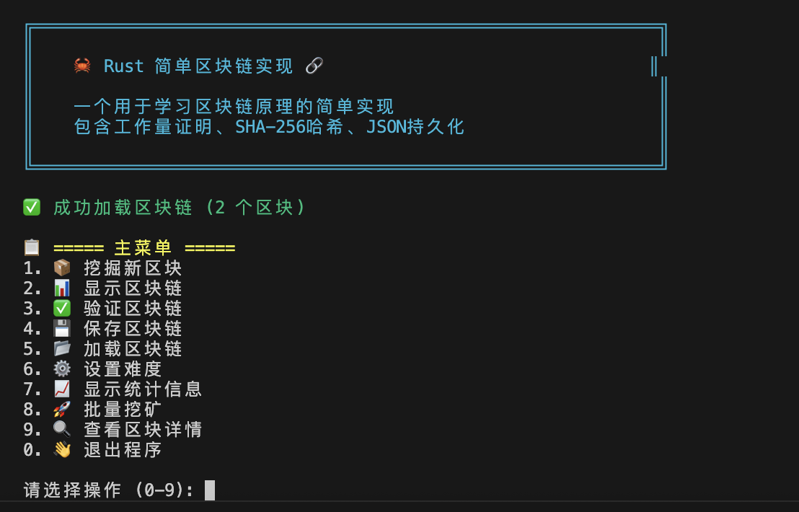

# Rust 简单区块链实现 🦀⛓️

[](https://www.rust-lang.org/)
[](https://opensource.org/licenses/MIT)
[](https://github.com/samxie52/simplied-blockchain-rust)

一个用 Rust 语言实现的简洁而完整的区块链系统，包含工作量证明共识机制、SHA-256 哈希算法和 JSON 数据持久化。非常适合学习区块链基础知识和 Rust 开发。



## 🌟 项目特性

- **完整区块链实现**：创世区块创建、挖矿、链验证等核心功能
- **工作量证明共识**：可调节难度的挖矿算法
- **密码学安全**：SHA-256 哈希算法与随机数处理
- **数据持久化**：JSON 格式的区块链存储
- **挖矿模拟**：实时挖矿与性能指标监控
- **链完整性验证**：全面的区块链完整性检查
- **命令行界面**：易于使用的命令行交互界面
- **批量挖矿**：支持批量挖掘多个区块
- **统计信息**：详细的区块链性能统计
- **区块详情查看**：单个区块的深度分析

## 🚀 快速开始

### 环境要求

- [Rust](https://rustup.rs/) (最新稳定版本)
- Git

### 安装步骤

```bash
# 克隆仓库
git clone https://github.com/samxie52/simplied-blockchain-rust.git
cd simplied-blockchain-rust

# 构建项目
cargo build --release

# 运行区块链
cargo run
```

### 基本使用

```bash
# 启动交互式菜单
cargo run

# 挖掘包含数据的新区块
cargo run -- mine "你好，区块链！"

# 验证整个区块链
cargo run -- validate

# 显示完整区块链
cargo run -- display

# 显示统计信息
cargo run -- stats

# 显示帮助信息
cargo run -- help
```

## 📋 项目结构

```
simplied-blockchain-rust/
├── src/
│   ├── main.rs          # CLI 界面和主程序逻辑
│   ├── blockchain.rs    # 核心区块链实现
│   ├── block.rs         # 区块结构和挖矿逻辑
│   └── utils.rs         # 工具函数（UI、格式化等）
├── data/
│   └── blockchain.json  # 持久化区块链数据（运行时创建）
├── Cargo.toml           # 依赖和项目元数据
├── README.md            # 本文档
└── .gitignore           # Git忽略文件
```

## 🏗️ 系统架构

### 区块结构

```rust
#[derive(Serialize, Deserialize, Debug, Clone, PartialEq)]
pub struct Block {
    pub index: u64,                    # 区块索引
    pub timestamp: DateTime<Utc>,      # 时间戳（使用chrono::DateTime）
    pub data: String,                  # 数据内容
    pub previous_hash: String,         # 前一区块哈希
    pub hash: String,                  # 当前区块哈希
    pub nonce: u64,                    # 随机数（挖矿用）
    pub difficulty: u32,               # 挖矿难度
}
```

### 区块链结构

```rust
#[derive(Serialize, Deserialize, Debug, Clone)]
pub struct Blockchain {
    pub chain: Vec<Block>,                    # 区块链
    pub difficulty: u32,                      # 当前难度
    pub mining_reward: u64,                   # 挖矿奖励
    pub pending_transactions: Vec<String>,    # 待处理交易
}
```

### 核心组件

1. **区块（Block）**：单个区块链区块，支持工作量证明挖矿
2. **区块链（Blockchain）**：区块链管理和验证
3. **挖矿（Mining）**：工作量证明算法实现
4. **持久化（Persistence）**：基于 JSON 的数据存储
5. **CLI界面**：交互式命令行界面
6. **统计分析**：性能指标和数据分析

## 🔧 技术实现详解

### 工作量证明算法

区块链使用简单的工作量证明共识机制：

```rust
pub fn mine_block(&mut self) {
    let target = "0".repeat(self.difficulty as usize);
    let start_time = std::time::Instant::now();
    let mut hash_count = 0u64;

    println!("🔨 开始挖掘区块 #{} (难度: {})...", self.index, self.difficulty);
    
    loop {
        self.hash = self.calculate_hash();
        hash_count += 1;

        if self.hash.starts_with(&target) {
            let elapsed = start_time.elapsed();
            let hash_rate = hash_count as f64 / elapsed.as_secs_f64();
            
            println!("✅ 区块挖掘成功!");
            println!("🎯 哈希值: {}", self.hash);
            println!("🔢 Nonce: {}", self.nonce);
            println!("⏱️  耗时: {:.2}秒", elapsed.as_secs_f64());
            println!("🚀 哈希率: {:.0} H/s", hash_rate);
            break;
        }
        
        self.nonce += 1;
    }
}
```

### 哈希计算

使用 SHA-256 进行密码学哈希：

```rust
pub fn calculate_hash(&self) -> String {
    let data = format!(
        "{}{}{}{}{}{}",
        self.index,
        self.timestamp.timestamp(),
        self.data,
        self.previous_hash,
        self.nonce,
        self.difficulty
    );
    
    let mut hasher = Sha256::new();
    hasher.update(data.as_bytes());
    format!("{:x}", hasher.finalize())
}
```

### 区块链验证

全面的区块链完整性验证：

```rust
pub fn is_chain_valid(&self) -> bool {
    // 检查创世区块
    if self.chain.is_empty() {
        return false;
    }
    
    let genesis = &self.chain[0];
    if genesis.index != 0 || genesis.previous_hash != "0" {
        return false;
    }
    
    // 验证每个区块
    for i in 1..self.chain.len() {
        let current_block = &self.chain[i];
        let previous_block = &self.chain[i - 1];
        
        // 验证当前区块哈希
        if !current_block.is_valid() {
            return false;
        }
        
        // 验证工作量证明
        if !current_block.has_valid_proof_of_work() {
            return false;
        }
        
        // 验证区块链连接
        if current_block.previous_hash != previous_block.hash {
            return false;
        }
        
        // 验证区块索引
        if current_block.index != previous_block.index + 1 {
            return false;
        }
    }
    
    true
}
```

## 📊 性能指标

基于实际测试结果（Apple Silicon M系列处理器）：

| 挖矿难度 | 平均挖矿时间 | 哈希率 | 平均尝试次数 |
|----------|------------|--------|------------|
| 1        | ~0.001s    | ~50,000 H/s | ~16 |
| 2        | ~0.005s    | ~80,000 H/s | ~200 |
| 3        | ~0.080s    | ~100,000 H/s | ~4,000 |
| 4        | ~1.280s    | ~120,000 H/s | ~65,000 |

*测试环境：Apple Silicon (M系列) 处理器*

## 🎯 使用示例

### 交互式菜单

启动程序后，你将看到以下菜单：

```
📋 ===== 主菜单 =====
1. 📦 挖掘新区块
2. 📊 显示区块链
3. ✅ 验证区块链
4. 💾 保存区块链
5. 📂 加载区块链
6. ⚙️  设置难度
7. 📈 显示统计信息
8. 🚀 批量挖矿
9. 🔍 查看区块详情
0. 👋 退出程序
```

### 创建和挖掘区块

```rust
use simplied_blockchain_rust::{Blockchain, Block};

fn main() {
    let mut blockchain = Blockchain::new();
    
    // 添加新区块
    blockchain.add_block("第一笔交易".to_string()).unwrap();
    blockchain.add_block("第二笔交易".to_string()).unwrap();
    
    // 显示区块链
    blockchain.display_chain();
    
    // 验证区块链
    println!("区块链是否有效？{}", blockchain.is_chain_valid());
}
```

### JSON 数据持久化

```rust
// 保存区块链到文件
blockchain.save_to_file("data/blockchain.json")?;

// 从文件加载区块链
let loaded_blockchain = Blockchain::load_from_file("data/blockchain.json")?;
```

### 批量挖矿

```rust
// 批量挖掘10个区块
blockchain.batch_mine(10, "批量交易")?;
```

## 🧪 测试

### 运行所有测试

```bash
# 单元测试
cargo test

# 带输出的测试
cargo test -- --nocapture

# 运行特定测试
cargo test test_blockchain_creation
```

### 测试覆盖的功能

- 区块创建和验证
- 区块链完整性检查
- 挖矿算法
- JSON序列化/反序列化
- 错误处理

## 🔧 配置选项

### 调整挖矿难度

在程序运行时通过菜单选项6，或编辑 `src/blockchain.rs`：

```rust
impl Blockchain {
    const DEFAULT_DIFFICULTY: u32 = 2; // 调整这个值
}
```

### 自定义挖矿奖励

```rust
impl Blockchain {
    const DEFAULT_MINING_REWARD: u64 = 100; // 调整奖励数量
}
```

## 🎮 命令行参数

支持以下命令行参数：

```bash
# 挖掘新区块
cargo run -- mine "交易数据"

# 验证区块链
cargo run -- validate

# 显示区块链
cargo run -- display

# 显示统计信息
cargo run -- stats

# 显示帮助
cargo run -- help

# 显示版本
cargo run -- version
```

## 🤝 贡献指南

欢迎贡献！请遵循以下步骤：

1. **Fork** 本仓库
2. **创建** 特性分支 (`git checkout -b feature/amazing-feature`)
3. **提交** 更改 (`git commit -m '添加了惊人的特性'`)
4. **推送** 到分支 (`git push origin feature/amazing-feature`)
5. **创建** Pull Request

### 开发规范

- 遵循 Rust 命名约定
- 为新功能添加测试
- 更新相关文档
- 提交前运行 `cargo clippy`
- 使用 `cargo fmt` 格式化代码

## 📚 学习资源

### 区块链概念
- [比特币白皮书（中文）](https://bitcoin.org/files/bitcoin-paper/bitcoin_zh_cn.pdf)
- [区块链基础知识](https://www.binance.com/zh-CN/academy/blockchain)
- [工作量证明详解](https://academy.binance.com/zh/articles/proof-of-work-explained)

### Rust 开发
- [Rust 程序设计语言](https://kaisery.github.io/trpl-zh-cn/)
- [通过例子学 Rust](https://rustwiki.org/zh-CN/rust-by-example/)
- [Rustlings 练习](https://github.com/rust-lang/rustlings)

## 🐛 问题排查

### 常见问题

**问：编译失败，提示"找不到 crate"错误**
```bash
答：运行 `cargo clean && cargo build` 重新构建依赖
```

**问：挖矿耗时太长**
```bash
答：在程序中选择菜单选项6降低难度，或在 src/blockchain.rs 中修改 DEFAULT_DIFFICULTY
```

**问：JSON 文件损坏**
```bash
答：删除 data/blockchain.json 并重启应用程序
```

### 调试模式

启用详细日志记录：

```bash
RUST_LOG=debug cargo run
```

## 🚦 开发路线图

### 版本 2.0
- [ ] 网络层实现
- [ ] 交易池功能
- [ ] 多节点同步
- [ ] REST API 接口

### 版本 3.0
- [ ] 智能合约支持
- [ ] 替代共识机制
- [ ] Web 区块链浏览器
- [ ] 性能优化

## 📄 开源协议

本项目基于 MIT 协议开源 - 查看 [LICENSE](LICENSE) 文件了解详情。

## 🙏 致谢

- [中本聪](https://bitcoin.org/bitcoin.pdf) 提出的原始区块链概念
- [Rust 社区](https://www.rust-lang.org/zh-CN/community) 提供的优秀工具和支持
- [Bitcoin Core](https://github.com/bitcoin/bitcoin) 参考实现
- 所有帮助改进此项目的贡献者

## 📞 支持与联系

- **GitHub Issues**：[报告问题或请求功能](https://github.com/samxie52/simplied-blockchain-rust/issues)
- **项目讨论**：[社区讨论区](https://github.com/samxie52/simplied-blockchain-rust/discussions)
- **邮箱联系**：samxie52@gmail.com

## 🎓 学习目标

通过完成这个项目，你将学会：

- ✅ Rust 语言的实际应用和最佳实践
- ✅ 区块链技术的核心原理和实现
- ✅ 密码学哈希函数的使用
- ✅ 工作量证明共识机制
- ✅ 数据序列化和持久化
- ✅ 命令行程序开发
- ✅ 单元测试和集成测试
- ✅ 开源项目的标准化管理

## 🔍 代码亮点

### 优雅的错误处理
```rust
pub fn add_block(&mut self, data: String) -> Result<(), BlockchainError> {
    let previous_block = self.get_latest_block();
    let mut new_block = Block::new(
        previous_block.index + 1,
        data,
        previous_block.hash.clone(),
        self.difficulty,
    );
    
    new_block.mine_block();
    
    // 验证新区块
    if !new_block.is_valid() {
        return Err(BlockchainError::InvalidBlock("区块哈希无效".to_string()));
    }
    
    self.chain.push(new_block);
    Ok(())
}
```

### 高效的数据结构
```rust
pub struct Blockchain {
    pub chain: Vec<Block>,
    pub difficulty: u32,
    pub mining_reward: u64,
    pub pending_transactions: Vec<String>,
}
```

### 美观的CLI界面
```rust
pub fn display_banner() {
    println!("{}", "
╔══════════════════════════════════════════════════════════════╗
║                                                              ║
║    🦀 Rust 简单区块链实现 🔗                                ║
║                                                              ║
║    一个用于学习区块链原理的简单实现                          ║
║    包含工作量证明、SHA-256哈希、JSON持久化                   ║
║                                                              ║
╚══════════════════════════════════════════════════════════════╝
    ".bright_cyan());
}
```

---

<div align="center">
  <strong>用 ❤️ 和 Rust 构建</strong><br>
  <sub>如果这个项目对你有帮助，请给个 ⭐ 支持一下！</sub>
</div>